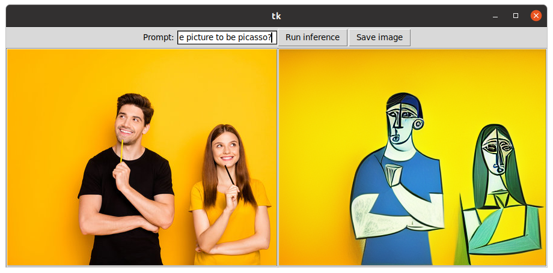
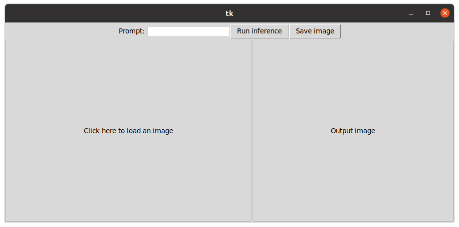
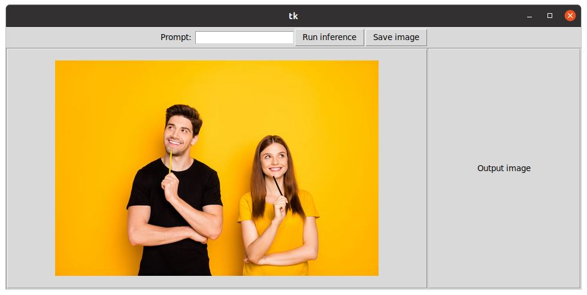
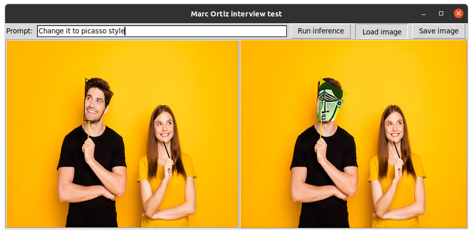

# Image style change with Stable diffusion

This repository contains code to run a stable diffusion model that generates new images, given an existing image and a promp text.
The software can be interacted via GUI or terminal, as shown in the picture below:

The model not only changes the style of the input image, but is also to interpret what you request in the prompt and add it to the final image.

## Installation
Install pytorch >= 2.0 with cuda support.

Install the requirements: `pip install -r requirements.txt` 

Add the location of the project to PYTHONPATH: \
`export PYTHONPATH=$PYTHONPATH/path/to/project/folder`

## Usage
#### Step 1: Run the interface
Execute the script you'll find in `./src/gui/gui.py`. It will take a bit of time to open since it's loading the model. \

#### Step 2: Click on the left side of the panel to load an image

#### Step 3: Write a prompt and click button to run  inference

#### Optional: Run without interface
You can also run the code without a graphical interface. To do so, please execute the script in `./src/ai/inference.py` with the right arguments.

## Improvements
* Select the region in the image that you want the style to be applied
* Possibility to generate an image from scratch with the prompt

## Information
**Author**: Marc Ortiz Torres \
**email**: ortiztorresmarc@gmail.com