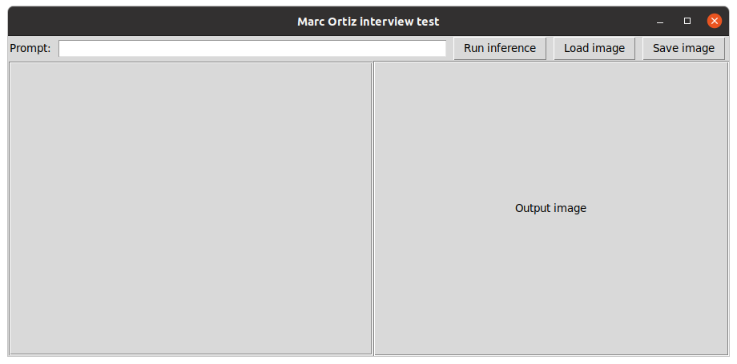
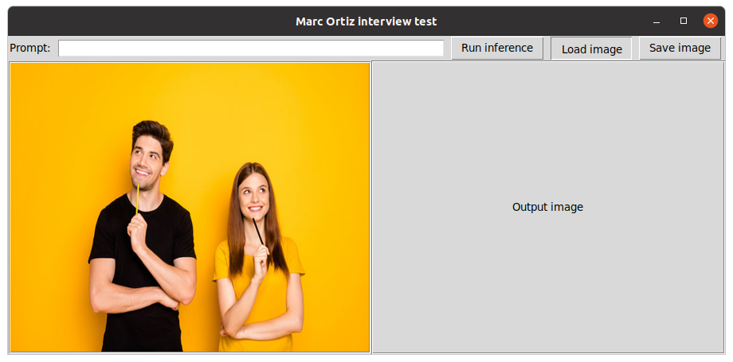
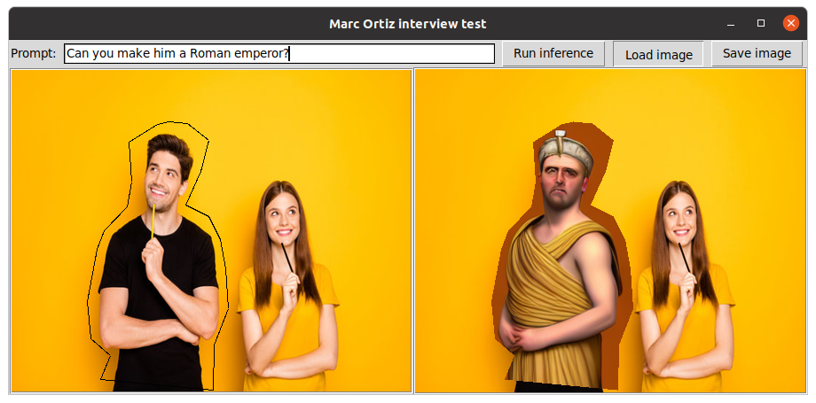

# Image style transfer with Stable diffusion

This repository contains code to run a stable diffusion model to generates new images from a reference image and a prompt.
The software can be interacted via terminal or GUI, as shown in the picture below:

The model not only changes the style of the input image, but is also to interpret what you request in the prompt and add it to the final image.

## Installation
1) Install pytorch >= 2.0 with **cuda support**.

2) Install Tkinter: `sudo apt-get install python-tk ` in Ubuntu.

3) Create a conda environment: `conda env create -f environment.yml` 

4) Activate the conda environment: `conda activate stable-diffusion-interactive`

5) Add the location of the project to PYTHONPATH: \
`export PYTHONPATH=$PYTHONPATH:/path/to/project/folder`

## Usage
#### Step 1: Run the interface
Execute the script you'll find in `./src/gui/gui.py`. It will take a bit of time to open since it's loading the model. \

#### Step 2: Load an image

#### Step 3: Write a prompt and click the button to run  inference

You can also select a polygon in the input image where you want the prompt to be applied. 
In the following example, we take a portrait of a person and change it to become a gladiator.
The polygon is built by clicking the desired area in the input image. To clear the polygon just click with the right button of the mouse.

#### Optional: Run without interface
You can also run the code without a graphical interface. To do so, please execute the script in `./src/ai/inference.py`.

## Room for improvement
Here I list some improvements that could be done to the project:
* Implement a metric that allows the user to select the best output of the generative model based on some threshold.
* Use a segmentation model to detect better the contour of the parts of the image we want to change.
* Have the option to generate an image from scratch with a prompt.

## Information
**Author**: Marc Ortiz Torres \
**email**: ortiztorresmarc@gmail.com